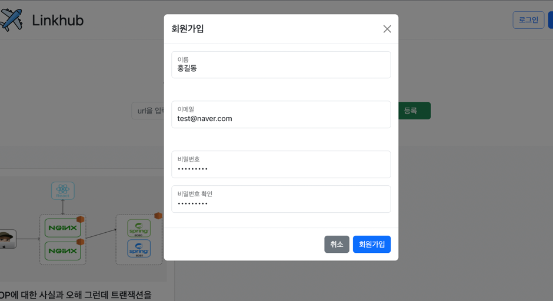
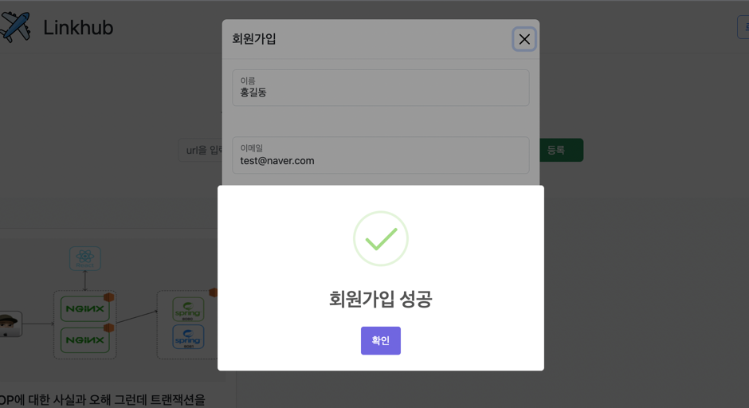
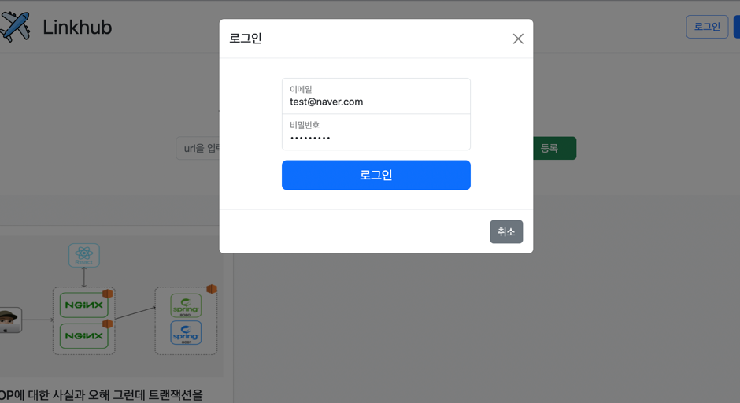
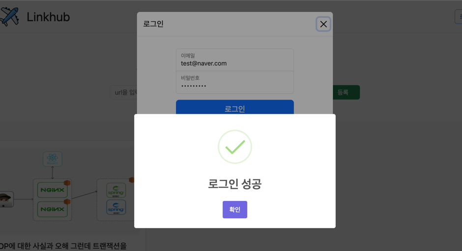
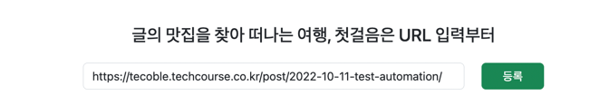
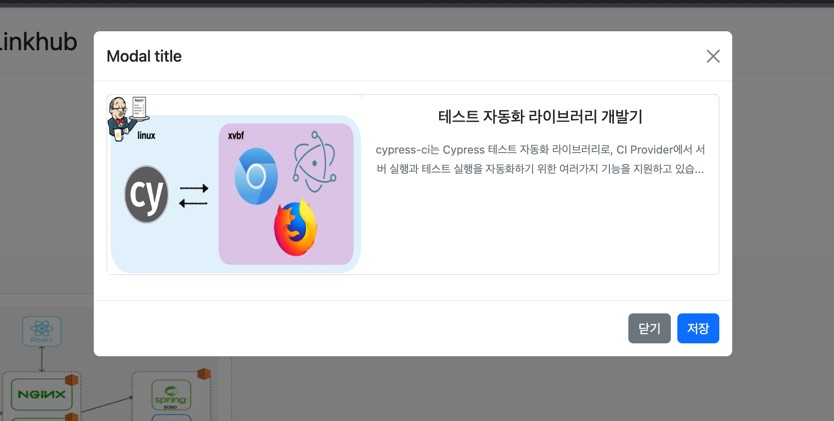
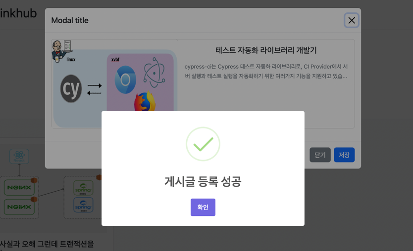
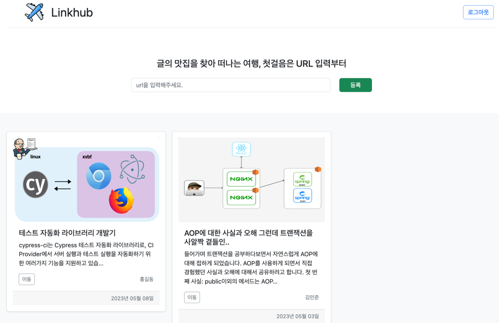
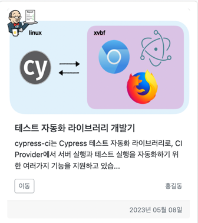

# Linkhub 

   

   
   

- ## &nbsp; :truck:    &nbsp; &nbsp; 프로젝트 개요

  - `Linkhub`는 인터넷의 유용한 글들을 url만 입력하면 게시글로 저장을 해주는 웹 서비스 입니다.
  - 공부하면서 유익한 글들을 개인적으로 스크랩 해놓은 경우가 많습니다. 혼자만 보기 아쉽기도 하고 여러 사람들과 공유하면서 공유도 받고 싶어 제작했습니다.
  
  
   
   

- ## &nbsp; :truck:    &nbsp; &nbsp; 기술스택
   #### [Back-end]
    
  
  
   #### [front-end]

    
 
  

- ## &nbsp; :truck:    &nbsp; &nbsp; 주요기능 
  **로그인 / 회원가입 / 로그아웃**

    > 1) 로그인 / 회원가입 / 로그아웃이 가능합니다.
    >
    > 2) 로그인을 한 사용자만 게시글을 등록할 수 있습니다.
    >

  **URL 등록 / 게시글 임시 저장 / 게시글 등록**

    > 1) 등록하고 싶은 글의 URL을 입력해 주세요. 형식은 (google.com https://google.com)을 준수해주세요.
    >
    > 2) 저장하고 싶은 글의 썸네일, 제목 , 설명을 확인합니다.
    >
    > 3) 마음에 들지 않으면 취소, 마음에 들면 저장 버튼을 눌러 게시글을 등록합니다!
    >
    > 4) 클릭 버튼을 통해 URL에 접속합니다..  
    >  

 
  
 
 ## &nbsp; :truck:    &nbsp; &nbsp; 향후 계획

- **배포** : 배포가 진행중입니다.
- **게시글 삭제** : 마음에 들지 않는 게시글을 삭제. 단 본인 글만.
- **게시글 수정** : 썸네일 , 제목 , 내용이 마음에 들지 않으면 수정.
- **좋아요** : 게시글에 좋아요
- **조회수** : 게시글 조회수
- **정렬** : 좋아요와 조회수에 따른 게시글 정렬
- **댓글** : 게시글 댓글

 
  

## &nbsp; :truck:    &nbsp; &nbsp; 서비스 소개
 
  

### 1. 메인 화면

---

### 2. 회원가입

#### 2-1. 회원 가입 성공

---

### 3. 로그인 화면

#### 3-1. 로그인 성공

---

### 4. 게시글 등록

#### 4-1. 게시글 미리보기

#### 4-2. 게시글 등록 성공

#### 4-3. 갱신된 페이지

---

### 5. 게시글 정보

